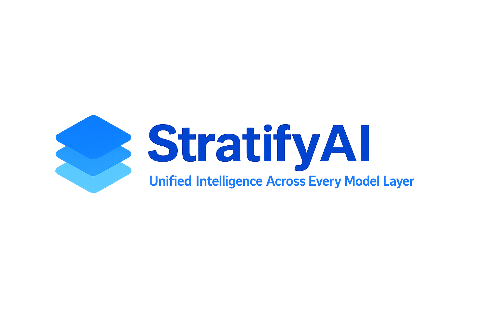
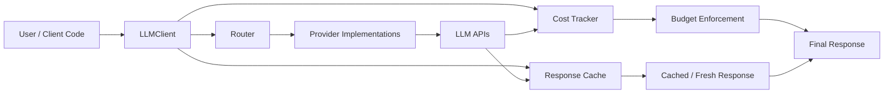
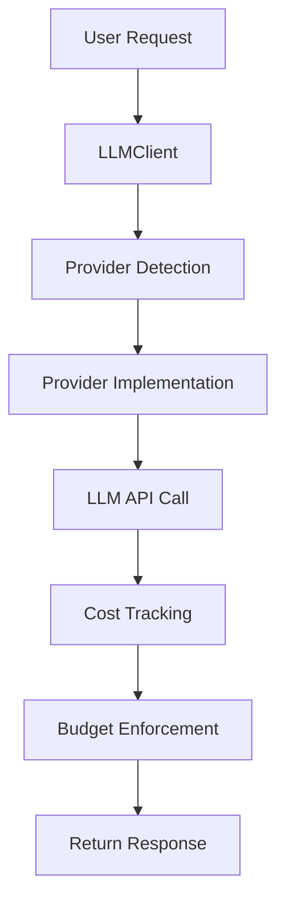

# **StratifyAI — Unified Intelligence Across Every Model Layer**

    

**Status:** Production Ready — MCP Ecosystem Complete  
**Version:** 2.1.0  
**Providers:** 9 Fully Integrated  
**Capabilities:** Routing • RAG • Caching • Streaming • CLI • Svelte 5 SPA • Vision • Smart Chunking • Async-First • **Prompt Templates** • **MCP Server & Client Engine** • **Custom MCP Management** • **CLI Interactive MCP**

StratifyAI is a production‑ready Python framework that unifies access to frontier LLM providers through a single, consistent API. It eliminates vendor lock‑in, simplifies multi‑model development, and provides intelligent routing, cost tracking, caching, streaming, and RAG capabilities for enterprise‑grade AI systems.

**Deployment references:** `docs/GETTING-STARTED.md`, `docs/API-REFERENCE.md`, `docs/VISION-SUPPORT.md`, `examples/README.md`

---

# **1. Why StratifyAI Matters**

Modern AI applications require flexibility across providers, models, and capabilities. StratifyAI provides:

- A **single interface** for 9+ LLM providers  
- **Automatic routing** to the best model for each task  
- **Cost control** with token tracking and budgets  
- **Resilience** through retries and fallback chains  
- **Advanced workflows** including RAG, extraction, and large‑file handling  

StratifyAI is designed for teams that need reliability, performance, and multi‑provider optionality without rewriting code.

---

# **2. Key Skills Demonstrated**

- **API Abstraction & Design Patterns**  
  Strategy pattern, factory pattern, provider abstraction

- **Multi‑Provider Integration**  
  OpenAI, Anthropic, Google, DeepSeek, Groq, Grok, OpenRouter, Ollama, AWS Bedrock

- **Production Engineering**  
  Error handling, retry logic, cost tracking, budget management

- **Python Best Practices**  
  Type hints, dataclasses, abstract base classes, decorators

- **Testing & Quality**  
  Unit tests, integration tests, 80%+ coverage target

- **DevOps & Packaging**  
  PyPI preparation, uv/pip dependency management

---

# **3. Platform Overview**

StratifyAI is a multi‑provider LLM abstraction layer that allows developers to switch between AI models without changing their code. It provides:

- Unified interface  
- Intelligent routing  
- Cost tracking  
- Streaming  
- Caching  
- Retry logic  
- Budget enforcement  
- RAG integration  
- Large‑file processing  
- CLI and Web UI  

---

# **4. Core Platform Features**

## **4.1 Unified Interface**
- One API for all providers  
- Zero code changes when switching models  
- Automatic provider detection  

## **4.2 Reliability & Performance**
- **Async-first architecture** with native SDK clients (AsyncOpenAI, AsyncAnthropic, aioboto3)
- Sync wrappers (`chat_sync()`, `chat_completion_sync()`) for convenience
- Retry logic with exponential backoff  
- Fallback model chains  
- Cost tracking and budget enforcement
- Latency tracking (milliseconds) on all responses
- Streaming support for all providers  

## **4.3 Intelligence Layer**
- Router with cost/quality/latency/hybrid strategies  
- Prompt complexity analysis  
- Capability filtering (vision, tools, reasoning)  
- Model metadata with labels (context window, latency, cost, category)  
- Dynamic model validation via provider APIs

## **4.4 Vision Support**
- **Image analysis** for vision-capable models (GPT-4o, Claude, Gemini, Nova)
- Automatic vision validation before upload
- Dynamic file input (images enabled only for vision models)
- Supports JPG, PNG, GIF, WebP formats (max 5MB)

## **4.5 Advanced Capabilities**
- Response caching + provider prompt caching  
- **Smart chunking** with configurable chunk size for large files
- Progressive summarization for token reduction
- File extraction (CSV, JSON, logs, code)  
- Auto model selection for extraction tasks  
- RAG pipeline with embeddings + ChromaDB  
- Semantic search and citation tracking
- **Prompt Templates**: 10 built-in reusable templates for common tasks
- User-extensible template system with YAML configuration
- Template integration with ChatBuilder, CLI, and REST API

## **4.7 MCP Ecosystem**

Complete Model Context Protocol implementation across server, client, and management layers:

- **MCP Server**: 8 tools, 5 resources, 13+ prompts exposing StratifyAI capabilities to MCP clients
- **MCP Client Engine**: Spawn and manage external MCP servers, aggregate tools into chat sessions
- **MCP Abstraction Layer**: Curated catalog of 20 MCP servers, CLI wizard, config generation for Claude Desktop/Code/Cursor/VS Code
- **Custom MCP Management**: Add, edit, delete, import, and export non-catalog servers via Web UI, CLI, or API
- **CLI Interactive MCP**: `stratifyai interactive --mcp-server postgresql` for MCP-powered CLI chat with runtime `/mcp` commands (status, on/off, tools, refresh)
- **Permission System**: Allow/deny/confirm rules with destructive tool gating and per-server policies

## **4.6 Svelte 5 Web UI**

Production-ready **Single Page Application** with modern features:

### Interface
- **Tabbed Layout**: Config, Files, History, Cost tracking
- **Real-time Streaming**: WebSocket-based chat with live token display
- **File Attachments**: Support for text files and images (vision models)
- **Smart Chunking**: Configurable 10k-100k character chunking for large files
- **Theme Toggle**: Dark/light themes with localStorage persistence

### Model Management
- **Model Catalog Browser**: Browse all models with advanced filtering
- **Capability Badges**: Visual indicators for vision, tools, reasoning support
- **Model Validation**: Real-time API key validation and availability checking
- **Category Grouping**: Organized model selection by capability tier

### Content Rendering
- **Markdown Rendering**: Full markdown support with syntax highlighting
- **Syntax Highlighting**: 190+ languages supported via highlight.js
- **XSS Protection**: DOMPurify sanitization for secure content display
- **Cost Tracking**: Per-message and session-level cost analytics

### Technical Stack
- **Svelte 5**: Modern reactive framework (48 files, ~8,500 lines)
- **TypeScript**: Full type safety matching backend types
- **Vite 6**: Fast build and dev server
- **WebSocket**: Real-time bidirectional communication
- **Client-side Routing**: SPA navigation with fallback support

### Enterprise MCP Operations Notes
- Local MCP chat selections now persist in the Web UI and survive refreshes, reducing operator confusion during multi-server troubleshooting.
- Anthropic-backed chat automatically uses provider-safe MCP tool aliases for namespaced tools such as `postgresql.query`.
- The PostgreSQL MCP `query` tool is classified as **read-only** and can execute in chat without an extra approval gate.
- If PostgreSQL is marked **connected** but chat still reports it unavailable, the next place to check is the database credential in the configured connection string; transport health and database authentication are separate failure modes.

---

# **5. Architecture Overview**



## **5.1 Design Principles**

- Abstraction first  
- Strategy pattern for providers  
- Configuration‑driven model catalogs  
- Extensible metadata and capability matrices  

## **5.2 Core Components**
1. **BaseProvider** — shared interface for all providers  
2. **LLMClient** — unified client with routing and detection  
3. **Router** — intelligent model selection  
4. **CostTracker** — usage and budget management  
5. **Decorators** — caching, logging, retry  
6. **Chunking & Extraction** — large‑file processing  
7. **RAG Engine** — embeddings, vector DB, retrieval  
8. **Prompt Templates** — reusable parameterized prompts with registry

## **5.3 Request Flow**



---

# **6. Technology Stack**

- **Python 3.10+**
- **OpenAI SDK**, **Anthropic SDK**, **Google Generative AI**
- **boto3** for AWS Bedrock
- **pytest**, **pytest‑cov**, **mypy**, **ruff** (format + lint)
- **FastAPI** (optional web UI)
- **ChromaDB** for vector storage

---

# **7. Quick Start**

## **7.1 Installation**

```bash
git clone https://github.com/Bytes0211/stratifyai.git
cd stratifyai
uv sync
```

Or from PyPI:

```bash
uv pip install stratifyai
```

## **7.2 Configure API Keys**

```bash
cp .env.example .env
# Add your keys
```

Check configuration:

```bash
stratifyai check-keys
```

## **7.3 First Chat**

```bash
stratifyai chat -p openai -m gpt-4o-mini -t "Hello!"
```

## **7.4 Python Example (LLMClient)**

```python
from stratifyai import LLMClient
from stratifyai.models import Message, ChatRequest, ChatResponse

client: LLMClient = LLMClient()
request: ChatRequest = ChatRequest(
    model="gpt-4o-mini",
    messages=[Message(role="user", content="Explain quantum computing")]
)

# Async (recommended)
response: ChatResponse = await client.chat_completion(request)

# Sync wrapper for scripts/CLI
response: ChatResponse = client.chat_completion_sync(request)

print(response.content)
print(f"Cost: ${response.usage.cost_usd:.6f}")
print(f"Latency: {response.latency_ms:.0f}ms")
```

## **7.5 Chat Package (Simplified)**

```python
from stratifyai.chat import anthropic, openai
from stratifyai.models import ChatResponse

# Quick usage - model is always required
response: ChatResponse = await anthropic.chat("Hello!", model="claude-sonnet-4-5")
print(response.content)

# With options
response: ChatResponse = await openai.chat(
    "Explain quantum computing",
    model="gpt-4o-mini",
    system="Be concise",
    temperature=0.5
)
```

## **7.6 Builder Pattern (Fluent Configuration)**

```python
from stratifyai.chat import anthropic
from stratifyai.chat.builder import ChatBuilder
from stratifyai.models import ChatResponse

# Configure once, use multiple times
client: ChatBuilder = (
    anthropic
    .with_model("claude-sonnet-4-5")
    .with_system("You are a helpful assistant")
    .with_temperature(0.7)
)

# All subsequent calls use the configured settings
response: ChatResponse = await client.chat("Hello!")
response: ChatResponse = await client.chat("Tell me more")

# Stream with builder
async for chunk in client.chat_stream("Write a story"):
    print(chunk.content, end="", flush=True)
```

---

# **8. CLI Features**

- Chat (streaming or non‑streaming)  
- Interactive mode with file attachments and MCP server support
- MCP interactive commands: `--mcp-server`, `--mcp-all`, runtime `/mcp` subcommands
- MCP server management: `mcp add-custom`, `mcp export-custom`, `mcp import-custom`, `mcp status`
- Routing with cost/quality/latency/hybrid strategies  
- Model and provider listing  
- Cache inspection and clearing  
- File analysis (CSV/JSON/logs/code)  
- Auto model selection for extraction tasks  
- RAG indexing and retrieval  

---

# **9. RAG Features**

- Embeddings (OpenAI)  
- ChromaDB vector storage  
- Document indexing and chunking  
- Semantic search  
- Retrieval‑augmented generation  
- Citation tracking  

---

# **10. Project Structure**

```
stratifyai/
├── frontend/             # Svelte 5 SPA (48 files, ~8,500 lines)
│   ├── src/              # SPA source code
│   │   ├── App.svelte    # Main app component
│   │   ├── lib/          # Components, stores, API clients
│   │   └── styles/       # SCSS styling
│   ├── package.json      # Frontend dependencies
│   └── vite.config.ts    # Vite build configuration
├── api/                  # FastAPI REST API + WebSocket
│   ├── main.py           # API endpoints, streaming
│   └── static/           # Served assets
│       ├── dist/         # Built SPA (from frontend/)
│       └── index.html    # Legacy fallback
├── stratifyai/           # Core package
│   ├── providers/        # Provider implementations (9 providers)
│   ├── router.py         # Intelligent routing
│   ├── models.py         # Data models
│   ├── chat/             # Simplified chat modules
│   │   ├── builder.py    # ChatBuilder class
│   │   └── stratifyai_*.py # Provider-specific modules
│   ├── mcp_server/       # MCP server (8 tools, 5 resources, 13+ prompts)
│   ├── mcp_client/       # MCP client engine (spawn/manage external servers)
│   ├── mcp_catalog/      # MCP server catalog (20 curated servers)
│   └── utils/            # Utilities (token counting, extraction)
├── cli/                  # Typer CLI (chat, interactive [--mcp-server], mcp management)
├── examples/             # Usage examples
└── docs/                 # Technical documentation
```

---

# **11. Testing**

```bash
uv run pytest                                    # run all tests
uv run pytest --cov=stratifyai --cov=api         # with coverage
cd frontend && npx vitest run                    # frontend tests
```

**CI pipeline:** ruff lint/format, mypy type checks, pytest with 80% coverage gate, pip-audit vulnerability scanning.

---

# **12. Project Status**

**Current Phase:** Production Ready — MCP Ecosystem Complete  
**Progress:** All phases 1–15 complete, MCP ecosystem fully delivered  

### Completed Phases

- **Phases 1-6:** Core implementation, providers, CLI, routing, caching
- **Phase 7:** Large file handling, extraction, RAG, chat package, async-first, builder pattern, Svelte 5 SPA
- **Phases 8-9:** Prompt templates, CI/CD infrastructure
- **Phases 10-11:** Error handling, validation hardening
- **Phases 12-13:** Observability, performance (O(1) cache, concurrency limits)
- **Phase 14:** Developer experience (doctor CLI, structured errors)
- **Phase 15:** Security audit and hardening
- **MCP Server:** 8 tools, 5 resources, 13+ prompts (Phases 1-5, 7-8)
- **MCP Abstraction Layer:** Curated catalog, CLI wizard, Web UI, tool tester (AL-1 to AL-4)
- **MCP Client Engine:** Core engine, tool registry, chat integration, permissions, Web UI, API (CE-1 to CE-6)
- **Custom MCP Management:** Add, edit, delete, import/export via API, CLI, and Web UI (Phases 1-5)
- **CLI Interactive MCP:** Server discovery, chat routing, /mcp commands, error handling (Phases 1-4)

**Test Coverage:** 1,244 tests, 89% coverage

A detailed breakdown is in `docs/project-status.md` and `AGENTS.md`.

---

### Commit Messages

- Use clear, descriptive commit messages. Examples:
- feat(router): add hybrid routing strategy
- fix(caching): handle missing cache keys safely
- docs(readme): update quick start section

---

### **13.`CONTRIBUTING.md**`

#### Contributing to StratifyAI

Thanks for your interest in StratifyAI. This project is structured as a production‑grade Python library, and contributions should follow the guidelines below.

#### Development Setup

1. **Clone the repository**

```bash
git clone https://github.com/Bytes0211/stratifyai.git
cd stratifyai
```

---

## 14. License

Internal project — All rights reserved.

---
