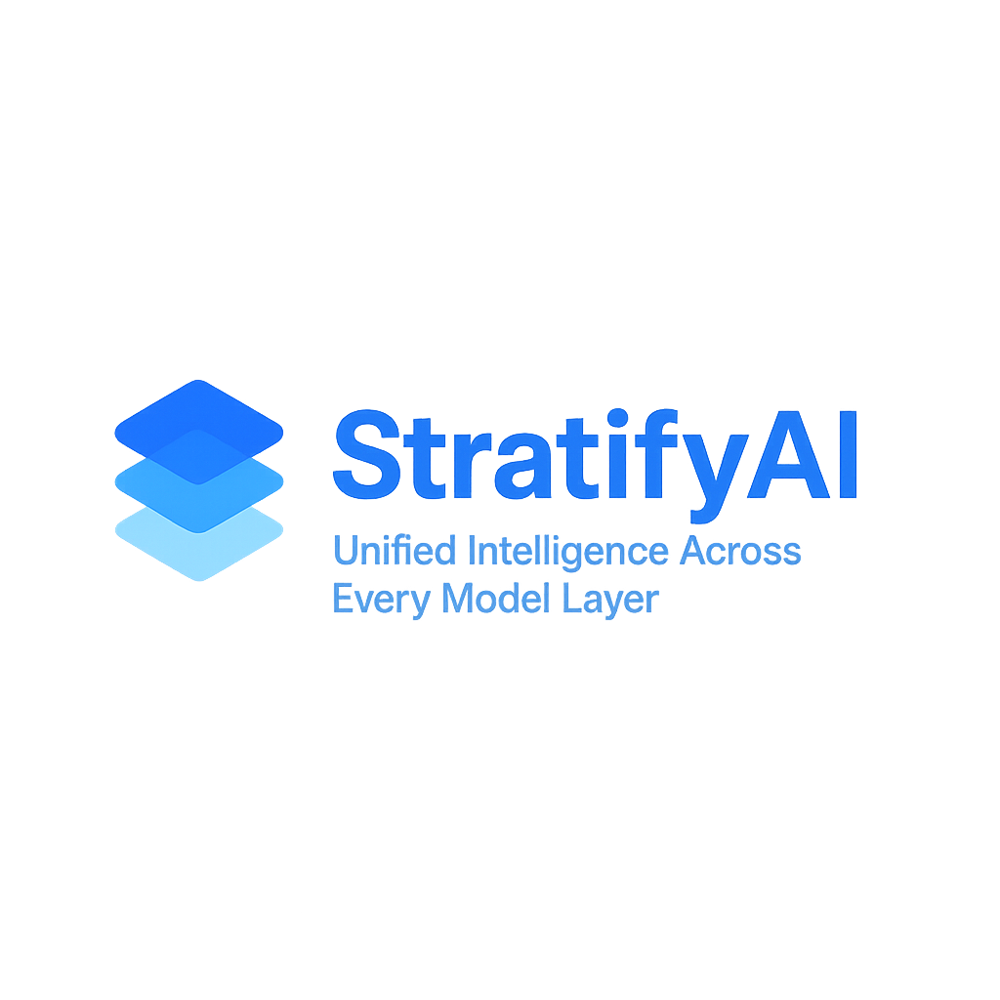

# StratifyAI — Unified Multi‑Provider LLM Interface

   

**Status:** Production Ready — MCP Ecosystem Complete (Server + Client Engine + Abstraction Layer)
**Providers:** 9 Operational
**Features:** Routing • RAG • Caching • Streaming • Observability • Security Hardening • CLI • Svelte 5 SPA • Vision • Smart Chunking • Prompt Templates • **O(1) Cache** • **Concurrency Limits** • **MCP Server & Client Engine**

StratifyAI is a production‑ready Python framework that provides a unified interface for 9+ LLM providers, including OpenAI, Anthropic, Google, DeepSeek, Groq, Grok, OpenRouter, Ollama, and AWS Bedrock. It eliminates vendor lock‑in, simplifies multi‑model development, and enables intelligent routing, cost tracking, caching, streaming, and RAG workflows.

**Start here:** `docs/GETTING-STARTED.md`  •  **Web UI guide:** `docs/UI-OVERVIEW.md`  •  **Examples:** `examples/README.md`  •  **Vision guide:** `docs/VISION-SUPPORT.md`

---

## Features

### Core

- Unified API for 9+ LLM providers
- Async-first architecture with sync wrappers
- Automatic provider detection
- Cost tracking and budget enforcement
- Latency tracking on all responses
- Retry logic with fallback models
- Streaming support for all providers
- **O(1) Cache with LRU eviction** + provider prompt caching
- **Concurrent read-write locking** (RWLockFair) for high-throughput caching
- **Provider concurrency limits** (max concurrent requests per provider)
- Correlation IDs for HTTP/WebSocket tracing
- Provider health and structured metrics endpoints
- Intelligent routing (cost, quality, latency, hybrid)
- Capability filtering (vision, tools, reasoning)
- Model metadata and context window awareness
- **Builder pattern** for fluent configuration
- **Vision support** for image analysis (GPT-4o, Claude, Gemini, Nova)
- **Prompt templates** with 10 built-in templates (code review, summarization, translation, etc.)
- User-defined template support via `~/.stratifyai/prompts/`
- **MCP Server** with 8 tools, 5 resources, 13+ prompts
- **MCP Client Engine** — spawn and manage external MCP servers, tool aggregation, chat integration
- **MCP Abstraction Layer** — curated server catalog, CLI wizard, inline tool tester
- **Permission system** for MCP tool safety (allow/deny/confirm, destructive tool gating)

### Advanced

- Large‑file handling with **smart chunking** and progressive summarization
- File extraction (CSV schema, JSON schema, logs, code structure)
- Auto model selection for extraction tasks
- RAG pipeline with embeddings + vector DB (ChromaDB)
- Semantic search and citation tracking
- Rich/Typer CLI with interactive mode
- **Svelte 5 SPA** with tabbed interface, real-time streaming, and file attachments
- **Web UI Features**: Markdown rendering, syntax highlighting, cost tracking, model catalog browser

### Operations & Observability

- `GET /api/health` for basic API liveness
- `GET /health/providers` and `GET /api/health/providers` for provider readiness snapshots
- `GET /api/metrics` for structured JSON metrics export
- `X-Correlation-ID` support for HTTP tracing and `correlation_id` in WebSocket payloads
- Streaming telemetry including first-token and total latency in final WebSocket usage payloads

---

## Installation

```bash
git clone https://github.com/Bytes0211/stratifyai.git
cd stratifyai
pip install -e .
```

Or using `uv`:

```bash
uv sync
```

---

## Configuration

```bash
cp .env.example .env
# Add your API keys
```

Check configured providers:

```bash
stratifyai check-keys
```

### Security Runbook

For Phase 15 hardening guidance (threat model assumptions, staging/production
environment settings, verification commands, and incident response), see:

- `developer/runbook/phase15-security-runbook.md`

### MCP Ecosystem

StratifyAI includes a complete MCP (Model Context Protocol) implementation:

- **MCP Server**: Exposes StratifyAI capabilities (chat, routing, cost tracking) as MCP tools
- **MCP Client Engine**: Spawns and manages external MCP servers, aggregates tools into chat
- **MCP Abstraction Layer**: Curated catalog of 20 MCP servers, CLI setup wizard, config generation
- **Permission System**: Safety defaults, destructive tool confirmation, per-server toggles

Documentation:

- `docs/MCP-QUICKSTART.md` — Install, configure, first tool call
- `docs/MCP-TOOLS-REFERENCE.md` — All tools, resources, and prompts
- `docs/MCP-CLIENT-CONFIG.md` — Client config for Claude Desktop, Claude Code, Cursor, VS Code
- `developer/PRD-MCP-implemenation.md` — Technical blueprint

#### Local MCP chat integration notes

- StratifyAI can auto-discover enabled MCP servers from **Claude Desktop**, **Cursor**, and **VS Code** configs for chat use.
- The MCP dashboard and chat settings now support live refresh from disk and show the config source client for each discovered server.
- **Reset config** in the MCP tab can now clear selected or all applied MCP server entries, including the matching `stratifyai.mcpClient` metadata.
- Anthropic-backed chats automatically receive **provider-safe MCP tool aliases**, so namespaced tools such as `postgresql.query` remain callable without hitting Anthropic's tool-name regex limits.
- If a tool appears in the UI but is never used, verify the server permission allow-list matches the **actual tool names**. Common examples:
  - PostgreSQL MCP: `"allow": ["query"]`
  - Brave MCP: `"allow": ["brave_*"]`

---

## Quick Start

### CLI Usage

```bash
stratifyai chat -p openai -m gpt-4o-mini -t "Hello"
stratifyai route "Explain relativity" --strategy hybrid
stratifyai interactive
stratifyai cache-stats
```

### Python Example (LLMClient)

```python
from stratifyai import LLMClient
from stratifyai.models import Message, ChatRequest, ChatResponse

client: LLMClient = LLMClient()
request: ChatRequest = ChatRequest(
    model="gpt-4o-mini",
    messages=[Message(role="user", content="Explain quantum computing")]
)

# Async (recommended)
response: ChatResponse = await client.chat_completion(request)

# Sync wrapper for scripts/CLI
response: ChatResponse = client.chat_completion_sync(request)

print(response.content)
print(f"Cost: ${response.usage.cost_usd:.6f}")
print(f"Latency: {response.latency_ms:.0f}ms")
```

### Python Example (Chat Package - Simplified)

```python
from stratifyai.chat import anthropic, openai
from stratifyai.models import ChatResponse

# Quick usage - model is always required
response: ChatResponse = await anthropic.chat("Hello!", model="claude-sonnet-4-5")
print(response.content)

# With options
response: ChatResponse = await openai.chat(
    "Explain quantum computing",
    model="gpt-4o-mini",
    system="Be concise",
    temperature=0.5
)
```

### Builder Pattern (Fluent Configuration)

```python
from stratifyai.chat import anthropic
from stratifyai.chat.builder import ChatBuilder
from stratifyai.models import ChatResponse

# Configure once, use multiple times
client: ChatBuilder = (
    anthropic
    .with_model("claude-sonnet-4-5")
    .with_system("You are a helpful assistant")
    .with_temperature(0.7)
)

# All subsequent calls use the configured settings
response: ChatResponse = await client.chat("Hello!")
response: ChatResponse = await client.chat("Tell me more")

# Stream with builder
async for chunk in client.chat_stream("Write a story"):
    print(chunk.content, end="", flush=True)
```

### Prompt Templates

```python
from stratifyai.chat import anthropic
from stratifyai.prompts import registry

# Use a built-in template
response = await (
    anthropic
    .with_model("claude-sonnet-4-20250514")
    .with_template("code_review", code=source_code, language="python", focus="security")
    .chat("Review this code")
)

# CLI usage
# stratifyai templates  # List all templates
# stratifyai chat --template summarize --params "style=bullet_points" --file document.txt
```

---

## Web UI

StratifyAI includes a production-ready **Svelte 5 SPA** with modern UI/UX.

> For the dedicated Web UI quick start and walkthrough, see `docs/UI-OVERVIEW.md`.

### Features
- **Tabbed Interface**: Config, Files, History, Cost tracking
- **Real-time Streaming**: WebSocket-based streaming chat with live token display
- **File Attachments**: Text files and images (for vision models)
- **Smart Chunking**: Configurable chunking (10k-100k chars) for large files
- **Model Catalog Browser**: Browse all models with filtering and capability badges
- **Markdown Rendering**: Syntax highlighting with highlight.js (190+ languages)
- **Cost Tracking**: Real-time cost analytics per message and session
- **Theme Toggle**: Dark/light themes with localStorage persistence
- **Model Validation**: Real-time API key validation and model availability
- **MCP Tools in Chat**: Enable discovered local MCP servers per conversation with live refresh and status visibility

### Quick Start

```bash
# Install frontend dependencies
cd frontend
npm install

# Build the SPA
npm run build

# Start the API server (serves the built SPA)
cd ..
uvicorn api.main:app --reload --port 8080

# Open browser
open http://localhost:8080
```

### Development Mode

```bash
# Terminal 1: Start backend
uvicorn api.main:app --reload --port 8080

# Terminal 2: Start frontend dev server
cd frontend
npm run dev
```

### Observability Endpoints

```bash
# Basic health
curl http://localhost:8080/api/health

# Provider readiness
curl http://localhost:8080/health/providers

# Structured metrics (requires auth if STRATIFYAI_API_KEY is set)
curl -H "Authorization: Bearer $STRATIFYAI_API_KEY" http://localhost:8080/api/metrics
```

If you want request tracing in logs, send a correlation header:

```bash
curl -H "X-Correlation-ID: demo-trace-123" http://localhost:8080/api/health
```

---

## Routing

- **Cost**: choose cheapest model
- **Quality**: choose highest‑quality model
- **Latency**: choose fastest model
- **Hybrid (default)**: dynamic weighting based on complexity

---

## RAG

- Embeddings (OpenAI)
- ChromaDB vector storage
- Semantic search
- Document indexing
- Retrieval‑augmented generation
- Citation tracking

---

## Project Structure

```
stratifyai/
├── catalog/              # Model catalog (community-editable)
│   ├── models.json       # Provider model metadata
│   ├── schema.json       # JSON schema
│   └── README.md         # Contribution guidelines
├── frontend/             # Svelte 5 SPA (48 files)
│   ├── src/              # SPA source code
│   │   ├── App.svelte    # Main app component
│   │   ├── lib/          # Components, stores, API clients
│   │   └── styles/       # SCSS styling
│   ├── package.json      # Frontend dependencies
│   └── vite.config.ts    # Vite build configuration
├── api/                  # FastAPI REST API + WebSocket
│   ├── main.py           # API endpoints, streaming
│   └── static/           # Served assets
│       ├── dist/         # Built SPA (from frontend/)
│       └── index.html    # Legacy fallback
├── stratifyai/           # Core package
│   ├── catalog_manager.py # Loads models from catalog/
│   ├── providers/        # Provider implementations (9 providers)
│   ├── router.py         # Intelligent routing
│   ├── models.py         # Data models
│   ├── chat/             # Simplified chat modules with builder
│   ├── mcp_server/       # MCP server (8 tools, 5 resources, 13+ prompts)
│   ├── mcp_client/       # MCP client engine (spawn/manage external servers)
│   ├── mcp_catalog/      # MCP server catalog (20 curated servers)
│   ├── prompts/          # Prompt template system (10 built-in)
│   ├── profiles/         # Configuration profiles
│   └── utils/            # Utilities (token counting, extraction)
├── cli/                  # Typer CLI
├── examples/             # Usage examples
├── scripts/              # Validation and maintenance tools
└── docs/                 # Technical documentation
```

---

## Model Catalog

StratifyAI uses a **community-editable JSON catalog** (`catalog/models.json`) as the source of truth for provider model metadata. This enables:

- **Easy Updates**: Submit PRs to add/update/deprecate models
- **Automated Validation**: CI validates all changes via JSON schema
- **Deprecation Tracking**: Built-in lifecycle management
- **Dated Model IDs**: All models use dated IDs (e.g., `claude-3-haiku-20240307`) for reproducibility

**Contributing:**

To update the catalog (add new models, mark deprecations, update pricing):

1. Edit `catalog/models.json`
2. Validate: `python scripts/validate_catalog.py`
3. Submit PR (CI automatically validates)

See [docs/CATALOG_MANAGEMENT.md](docs/CATALOG_MANAGEMENT.md) for full contribution guidelines.

---

## Testing

```bash
pytest           # Run all tests
pytest -v        # Verbose output
```

**Test Coverage:** 669 tests across all modules (72% code coverage)

---

## License

Internal project — All rights reserved.

